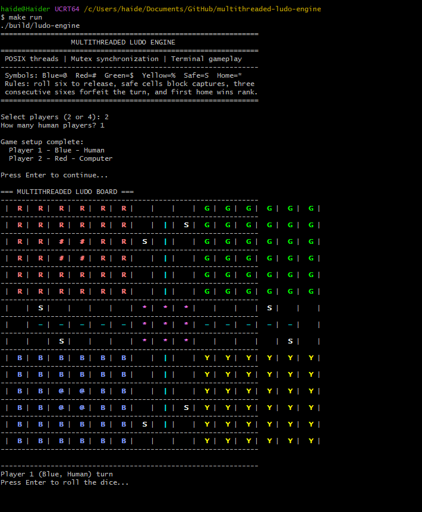
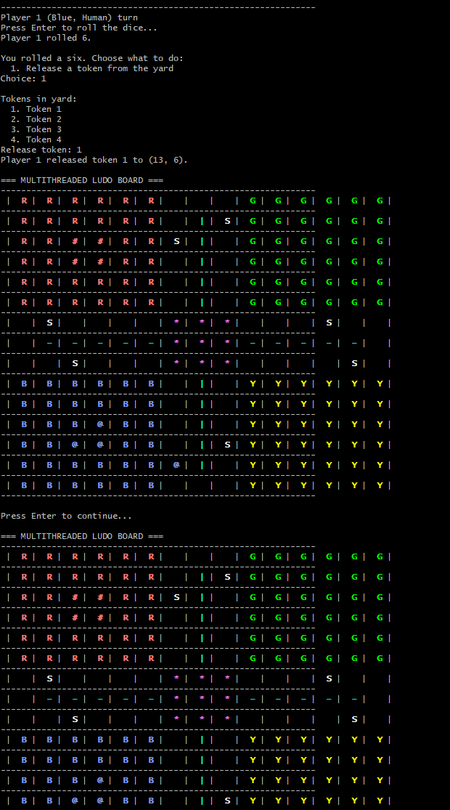
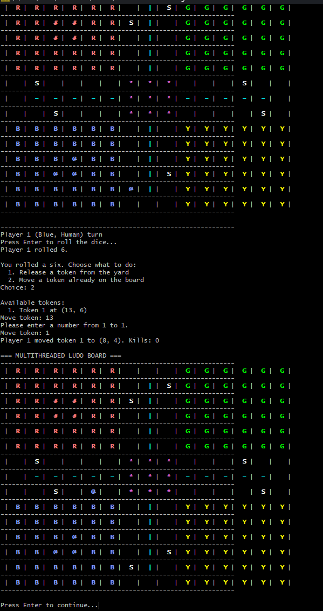

# Multithreaded Ludo Engine

A terminal-based Ludo simulation written in C++ with POSIX threads. The project models four concurrent player routines that share a single board state, coordinate turns through a mutex, and apply core Ludo mechanics such as dice rolls, token release, movement, captures, safe squares, home paths, and final rankings.

## Features

- Runs four player routines as separate POSIX threads.
- Protects shared game state with `pthread_mutex_t`.
- Uses a monitor thread to track completion and player rankings.
- Simulates dice rolling, token release on six, extra turns, and three-six forfeits.
- Moves tokens around a 52-cell board path.
- Supports safe squares where captures are blocked.
- Sends captured tokens back to their yard positions.
- Moves tokens through player-specific home paths.
- Prints a colored 15x15 board in the terminal.
- Starts with an interactive terminal setup screen.
- Supports 2-player and 4-player games.
- Allows any number of human players, with remaining players controlled by the computer.
- Lets human players roll dice and choose tokens from terminal prompts.
- Reports kill counts and final rank order when the game ends.

## Game Rules Modeled

| Rule | Behavior |
| --- | --- |
| Token release | A player can release a yard token after rolling six |
| Extra turn | Rolling six keeps the current player turn |
| Three sixes | Three consecutive sixes forfeits the turn |
| Movement | Active tokens advance around the shared board path |
| Safe squares | Tokens on safe cells cannot be captured |
| Capture | Landing on an opponent token sends it back to the yard |
| Home path | Tokens enter and advance through player-specific home paths |
| Ranking | Players are ranked when all four tokens reach home |

## Operating System Concepts

| Concept | Implementation |
| --- | --- |
| Threads | Each player runs through a `pthread_create` player routine |
| Synchronization | A mutex serializes access to the board and turn state |
| Shared memory | Player records, rankings, and board cells are shared globally |
| Critical section | Dice processing, movement, captures, and display happen under lock |
| Monitor thread | A separate routine watches completion and terminates the game cleanly |

## Gameplay

When the game starts, the terminal asks for:

1. Player count: `2` or `4`
2. Number of human players

Players are assigned in order:

```text
Player 1 - Blue
Player 2 - Red
Player 3 - Green
Player 4 - Yellow
```

If you choose one human player in a four-player game, Player 1 is controlled manually and Players 2-4 are controlled by the computer. Human turns wait for Enter before rolling, then show token choices when a move is available.

## Tech Stack

| Part | Tech |
| --- | --- |
| Language | C++ |
| Threading | POSIX Threads |
| Synchronization | pthread mutex |
| Interface | Terminal board renderer |
| Build | Makefile |


## Screenshots

### Game Setup



### Token Release



### Manual Token Movement



## Project Structure

```text
.
|-- src/
|   `-- ludo_engine.cpp      # Game simulation, thread routines, and board logic
|-- assets/                  # Gameplay screenshots
|-- Makefile                 # POSIX build and run commands
|-- .gitignore               # Build output and local file exclusions
`-- README.md
```

## Build Requirements

This project uses POSIX threads, so the compiler must provide `pthread.h`.

Supported environments:

- Linux
- Ubuntu through WSL on Windows
- macOS with a compatible compiler
- MSYS2 UCRT64 or MinGW-w64 with POSIX thread support

The default MinGW.org compiler on Windows may not include pthread support. Use MSYS2 UCRT64 or WSL if `g++` or `pthread.h` is missing.

## Run On Windows With MSYS2 UCRT64

Install MSYS2 from:

```text
https://www.msys2.org/
```

Open the **MSYS2 UCRT64** terminal and update packages:

```bash
pacman -Syu
```

If MSYS2 asks you to close the terminal, close it, open **MSYS2 UCRT64** again, then install the compiler and Make:

```bash
pacman -S mingw-w64-ucrt-x86_64-gcc make
```

Verify the tools:

```bash
g++ --version
make --version
```

Clone and run the project:

```bash
git clone https://github.com/haiderrrrrrr/multithreaded-ludo-engine.git
cd multithreaded-ludo-engine
make
make run
```

If the repository is already downloaded in `Documents/GitHub`, run:

```bash
cd /c/Users/haide/Documents/GitHub/multithreaded-ludo-engine
make
make run
```

## Run On Ubuntu Or WSL

Install WSL from Windows PowerShell if needed:

```powershell
wsl --install
```

Open Ubuntu, then install the build tools:

```bash
sudo apt update
sudo apt install build-essential git
```

Clone and run the project:

```bash
git clone https://github.com/haiderrrrrrr/multithreaded-ludo-engine.git
cd multithreaded-ludo-engine
make
make run
```

If the repository is already downloaded on Windows, run it from its mounted path:

```bash
cd /mnt/c/Users/haide/Documents/GitHub/multithreaded-ludo-engine
make
make run
```

## Common Commands

Build the engine:

```bash
make
```

Run the simulation:

```bash
make run
```

Clean build output:

```bash
make clean
```

Manual compile command:

```bash
g++ -std=c++11 -Wall -Wextra -O2 src/ludo_engine.cpp -o build/ludo-engine -pthread
```

## Code Overview

| Function | Purpose |
| --- | --- |
| `initializeBoardPath()` | Defines the 52-cell circular Ludo path |
| `initializeBoard()` | Builds the 15x15 logical board |
| `setupPlayers()` | Creates player records, tokens, colors, and yard positions |
| `playerRoutine()` | Runs each player thread and processes turns |
| `gameMonitor()` | Tracks home completion, rankings, and game shutdown |
| `processDiceRoll()` | Handles dice rules and extra turns |
| `moveToken()` | Selects and moves an eligible token |
| `eliminateOpponent()` | Applies capture logic with safe-square protection |
| `displayBoard()` | Prints the current board state with terminal colors |

## Notes

This is an operating-systems project focused on concurrency and synchronization. It is intentionally terminal-based so the thread behavior, shared-state updates, and board transitions remain visible while the simulation runs.
